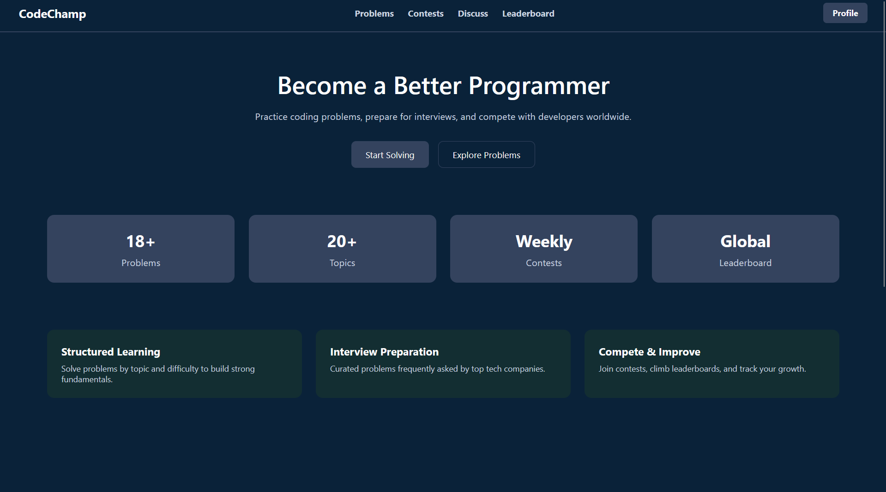
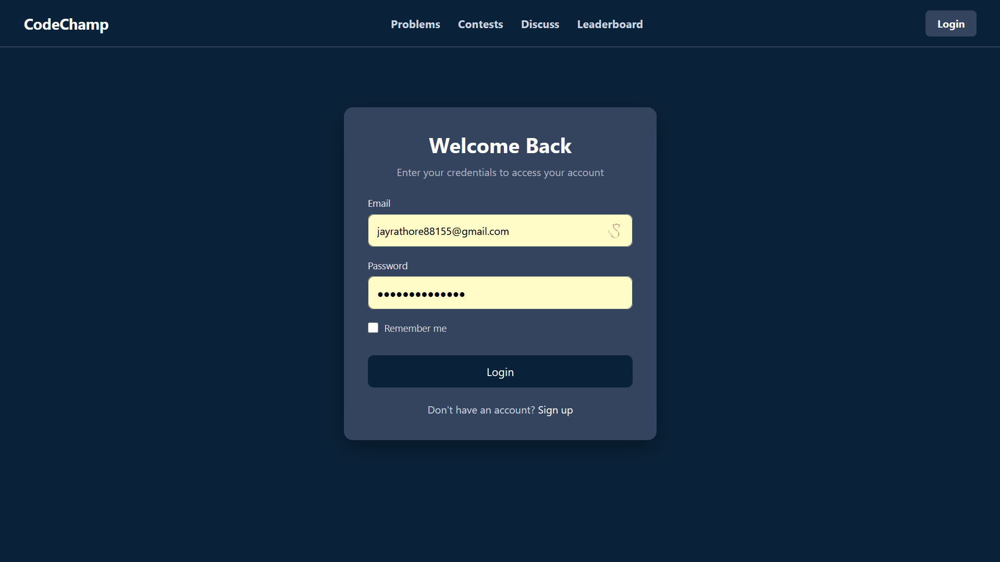
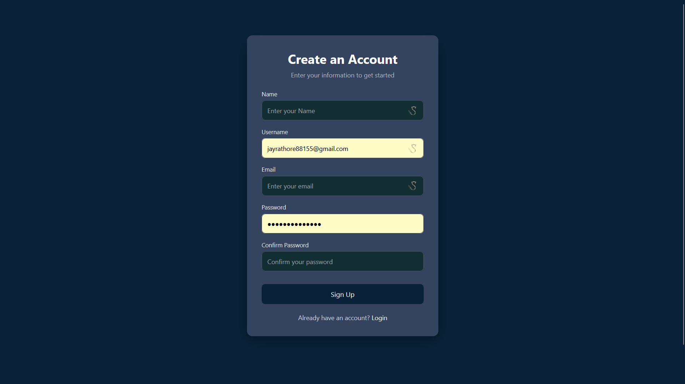
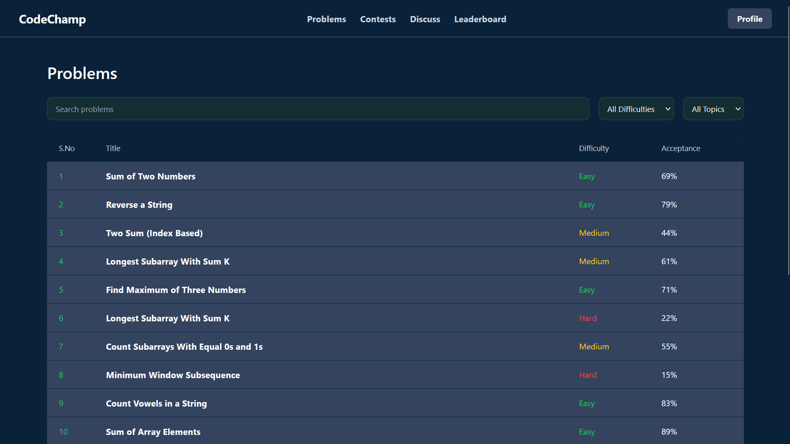
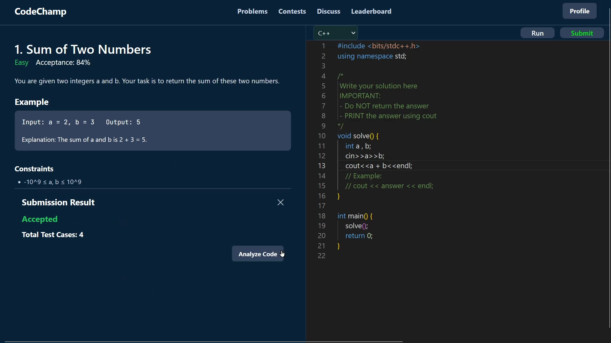
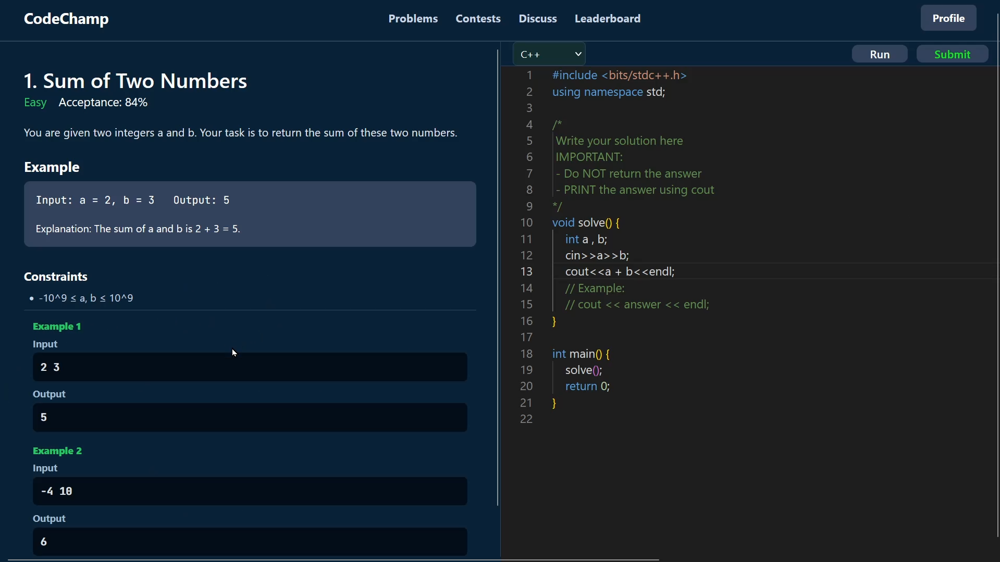
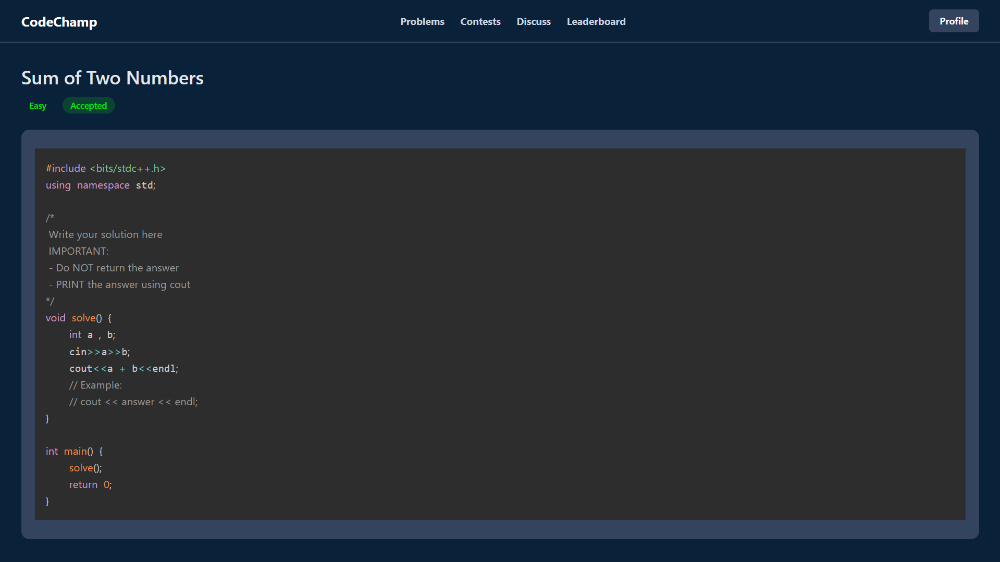
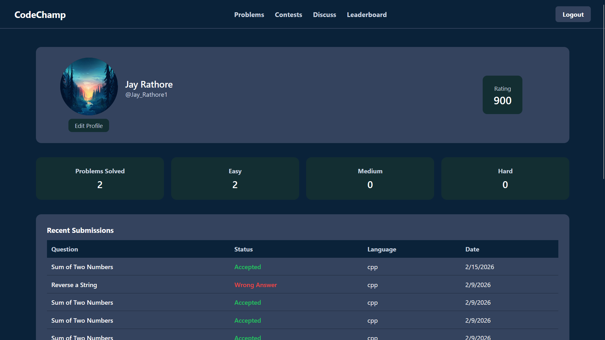

# LeetCode Clone

A full-stack coding platform inspired by LeetCode that enables users to practice data structures and algorithms problems in an interactive environment. The application provides problem browsing, code editing, execution, and result evaluation within a modern web interface.

**Live Demo:** https://leetcode-clone-pi-flame.vercel.app/

---

## Demo Video

You can watch the complete working demonstration below:

[Watch Demo Video](./assets/videos/demo.mkv)

---

## Screenshots

### Home Page


### Login Page


### Sign Up Page


### Problem List


### Problem Detail View 1


### Problem Detail View 2


### Code Editor


### Running Code State


### Submitted Question


### User Profile


---

## Overview

This project replicates the core functionality of an online coding judge. Users can browse problems, write solutions in an integrated code editor, and execute their code to verify correctness. The platform is designed with clean architecture, scalability, and maintainability in mind.

---

## Features

- Structured problem listing and detailed problem pages  
- Integrated code editor with syntax highlighting  
- Code execution and output evaluation  
- User authentication and session management  
- RESTful API architecture  
- Responsive user interface  

---

## Tech Stack

### Frontend
- React
- TypeScript
- CSS

### Backend
- Node.js
- Express

### Additional Tools
- REST APIs  
- Online code execution service integration  
- Vercel (Frontend deployment)  

---

## Project Structure

```
leetcode-clone/
│
├── client/                  
├── server/                  
├── assets/
│   ├── screenshots/
│   └── videos/
└── README.md
```

---

## Installation and Setup

### 1. Clone the Repository

```bash
git clone https://github.com/JayRathore10/leetcode-clone.git
cd leetcode-clone
```

### 2. Install Dependencies

```bash
cd client
npm install

cd ../server
npm install
```

### 3. Configure Environment Variables

Create a `.env` file inside the `server` directory and configure:

```
PORT=5000
MONGO_URI=your_database_connection_string
GEMINI_API_KEY=your_gemini_api_service_key
COOKIE_SECRET=your_cookie_secret
SALT_ROUND=your_hashing_salt_round
JWT_SECRET=your_jwt_secret
FRONTEND=your_frontend_url
VITE_BACKEND_URL=your_backend_url
```

Modify values according to your environment configuration.

### 4. Run the Application

Start backend:

```bash
cd server
npm run dev
```

Start frontend:

```bash
cd client
npm start
```

---

## Deployment

- Frontend deployed on Vercel  
- Backend can be deployed on Render, Railway, or any Node.js-supported hosting platform  

---

## Future Improvements

- Submission history tracking  
- User performance statistics dashboard  
- Difficulty filters and tagging system  
- Discussion section per problem  
- Admin panel for managing problems  

---

## Contributing

Contributions are welcome.

1. Fork the repository  
2. Create a feature branch  
3. Commit your changes  
4. Open a pull request with a clear description  

---

## License

This project is open-source and intended for educational and portfolio purposes.
